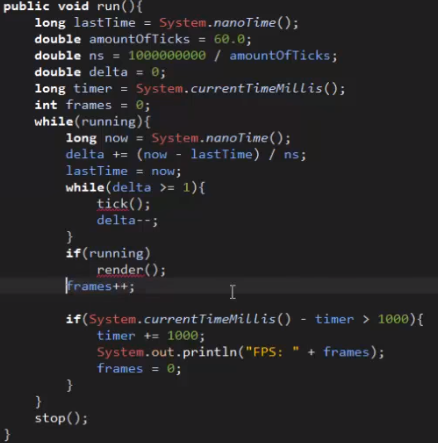

<h1>Java API-Independent-Study</h1>

Learning to make a game out of Java for the next 9 week, the third week, I began to watch a Yotube series on how to make a game in Java.

<a href = "https://www.youtube.com/watch?time_continue=1228&v=1gir2R7G9ws">Java Programming: Let's Build a Game #1</a> 

<h2>Watching YouTube Videos: RealTutsGML</h2>

After watching the RealTutsGML first video, I learn a lot of interesting mechanic on Eclipse and the Java language. This is a basic format for creating a Java game. This tutorial explained by the YouTuber is the main program to set up the game to make it work.

<ol>

<li>The <b>src</b> folder where everything are organized. The name of the folder can be created based on what you prefer to call it on your Java program.</li>

<li>After you created the package, right click on the file and you will be able to create a new <b>Class</b>. Basically is where the screen will be formatted and where it is handled and the main method of your game.</li>

<li>Eclipse allow you to place your cursor above a variable. If you are hovering over "Canvas" you can click on import to import the following below.</li>

<li>After you create the main method, you have to create another class call <b>Window.java</b> as another file. You would have to click on <b>Window</b> and right click on the generator to generate the class. A shortcut to get the <b>Canvas Impoort</b> by Contol + Shift + o. After this, you create the public Window below:</li>

``public Window(int width, int height, String title){ }``

<li>After this, you create the JFrame below: Creating a new Dimension oof the width and height, then copy and paste two more time. Using <b>.setPreferredSize</b>, <b>.setMaximumSize</b>, <b>.setMinimumSize</b>.</li>

``JFrame frame = new JFrame(title);``

<li>Adding on, you want to have the frame be set to exit on close such example as: After this, you want to have the <b>Resizeable</b> as false and <b>LocationRelative</b> to be null. Make sure to use <b>.add</b> as game and <b>Visible</b> to be true.</li>

``JFrame.EXIT_ON_CLOSE``

<li>Inside the Game.Java, you want to create a new method of the game class. Making the window with the width and height of the title. Depending on how big your window will be, your aspect ratio would return with the size. Creating the <b>private Thread thread</b> to create the game format and getting started as you add the <b>boolean running = false;</b> where the thread will be running on.</li>

<li>After this, you create an if statement as <b> try { catch(Exception e) { } }</b> usinf a catch statement if it can run, but if it cannot, then it run the next code. Make sure to add <b>thread.join</b> and <b>running = false</b>.</li>

<li>A game requires a game loop so that the game can update itself, used by every video game creator. A familiar game loop used by a lot of people is below.</li>

<a href = "http://www.java-gaming.org/index.php?topic=24220.0">Game Loop Logic</a> 

<li>You want to limit the FPS. by adding in a buffer strategy inside the render method. It will be this below. After you have <b>bs == null</b>, You want to set the buffer to 3 to set the amount of buffer created. No more then three, two is fine. You will see the flashing due to decrease buffer. You want to set the color as black and the width as <b>(0,0 WIDTH, HEIGHT)</b> to have a black screen.</li>

``BufferStrategy bs = this.getBufferStartegy()``

</ol>

<h2>Takeaway</h2>

<ol>

<li>Watching YouTube videos is beneficial because you listen or visually look at the video for tips or assistance on what you are learning about.</li>

<li>Eclipse is similar to the Github, but widely different because Eclipse uses Java for coding, some of the codes will be different.</li>

<li>If you want to learn something but you are a beginner for a certain language, make sure to search up YouTube videos to help you or ask your colleagues for lessons on it.</li>

<li>Make sure to take notes when you first watch the video, then you can rewatch again, listening to details you might have missed.</li>

<li>What I learn that taking information from a video and into notes is hard, but just make sure to take your time on it.</li>

</ol>