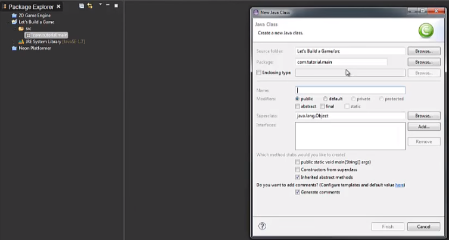

<h1>Java API-Independent-Study</h1>

Learning to make a game out of Java for the next 9 nine week, the third week, I began to watch a Yotube series on how to make a game in Java.

<a href = "https://www.youtube.com/watch?time_continue=1228&v=1gir2R7G9ws">Java Programming: Let's Build a Game #1</a> 

<h2>Watching YouTube Videos: RealTutsGML</h2>

After watching RealTutsGML first vidoe, I learn a lot of interesting mechanic on Eclipse and the Java language. This is a basic format to creating a Java game

<ol>

<li>The <b>src</b> folder where everything are organized. The name of the folder can be created based on what you prefer to call it on your Java program.</li>

<li>After you created the package, right click abover the file and you will be able to create a new <b>Class</b>. Basically is where the screen will be formatted and where it is handled and the main method of your game.</li>

<li>Eclipse allow you to place your curosor above a variable. If you are hovering over "Canvas" you can click on import to import the following below.</li>

<li></li>
<li></li>
<li></li>

</ol>

<h2>Takeaway</h2>

<ol>
<li>Watching YouTube videos is beneficial because you listen or visually look at the video for tips or assistance on what you are learning about.</li>
<li>Eclipse is similar to the Github, but widely differnt, because Eclipse uses Java for coding, some of the codes will be differnt.</li>
<li>If you want to learn something but you are a beginner for a certain language, make sure to search up YouTube videos to help you or ask your collagues for lessons on it.</li>
</ol>