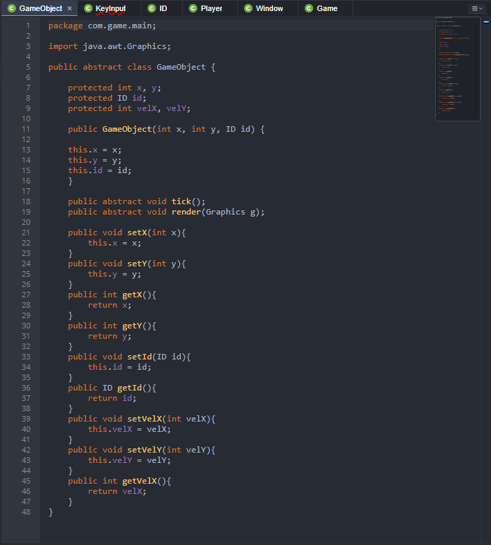
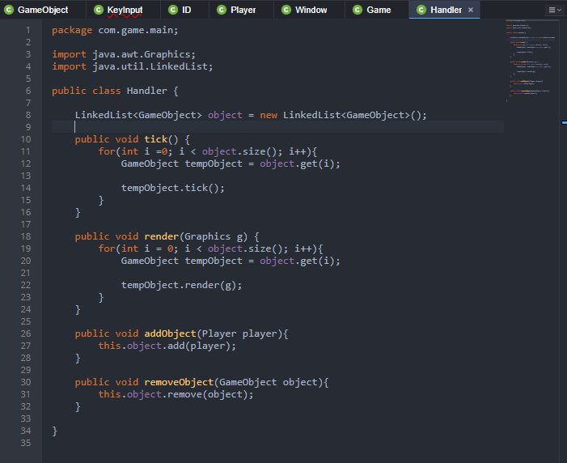
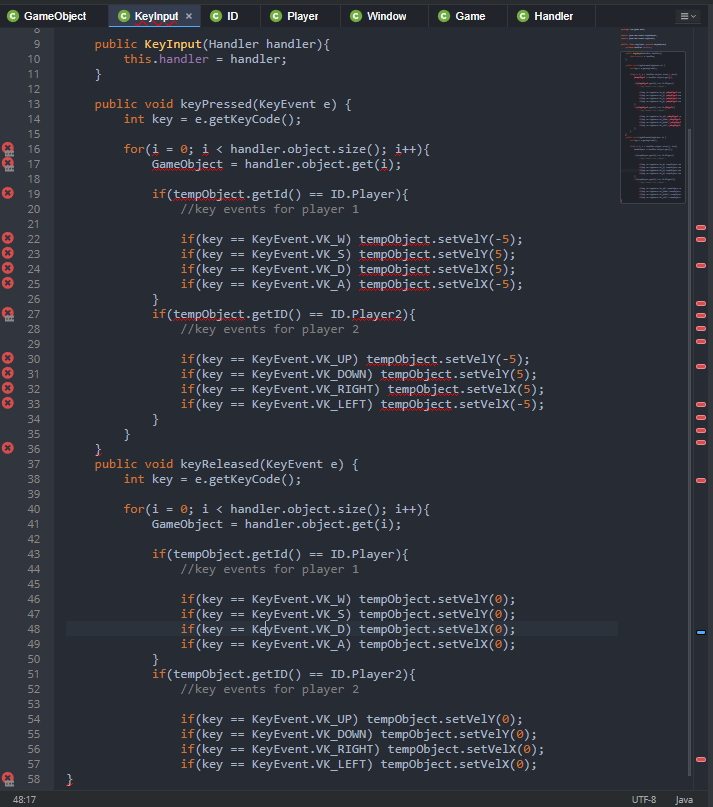

<h1>Java API-Independent-Study</h1>

Learning to make a game out of Java for the next 9 week, the third week, I watch a Yotube series on how to make a game in Java.

<a href = "https://www.youtube.com/watch?v=0T1U0kbu1Sk">Java Programming: Let's Build a Game #2</a> 

<h2>Watching YouTube Videos: RealTutsGML/Copying down the foundation to creating a java game.</h2>

After watching the RealTutsGML first video, I learn a lot of interesting mechanic on Eclipse and the Java language. This is a basic format for creating a Java game. This tutorial explained by the YouTuber is the main program to set up the game to make it work.

<ol>

<li>GameObject class</li>

Game Object allows the player and enemy to identify what is what such as an enemy to the player to items. Creating the <b>ID</b> the player and enemy to identify what you want to target.

``public GameObject(int x, int y, ID id){ this.x = x;  this.y = y;  this.id = id; }``

The <b>vel</b> of X, and Y allow it to control the speed of the object.

``protected int x, y;`` 

``protected ID id;``

``protected int velX, velY``

After this, you can begin creating the getter and setter method for the x and y variable is equal to the parameter.

``public void setX(int x){ this.x = x; }``

``public void setY(int y){ this.y = y; }``

``public int getX(){ return x; }``

``public int getX(){ return x; }``

``public void set Id(ID id){ this.id = id; }``

``public ID getId(){ return id }``

``public void set VelX(int velX){ this.velX = velX; }``

``public void set VelX(int velX){ this.velX = velX; }``

``public int getVelX(){ return velX; }``

``public int getVelY(){ return velY; }``

<li>Handler Class</li>

In Handler, this is where much GameObject class item it can have. You want to call something from the GameObject as a link while rendering the graphics and ticks. Adding on to this, the <b>for loop</b> allow it to loop through every game object that is different. The <b>i</b> is used to add a tick to each object. You then set a <b>tempObject</b> to grab the id of the object while grabbing only one set. Creating the tick for the tempObject. Then you want to render each game object and creating the tempObject to render it.

``public class Handler {``

``LinkedList<GameObject> object = new LinkedList<GameObject>();``
    
``public void tick() { for(int i =0; i < object.size(); i++){ GameObject tempObject = object.get(i); tempObject.tick(); } }``
    
``public void render(Graphics g) { for(int i = 0; i < object.size(); i++){ GameObject tempObject = object.get(i); tempObject.render(g); } }``

After this, you want the handler to get the list of the game objects while removing it. You create code, using object while adding it in the params object. Adding on, you want to render the object and removing it within the params.

``public void addObject(GameObject object){ this.object.add(object); }``

``public void remove Object(GameObject object){ this.object.remove(object); }``

<li>KeyInput Class</li>

Key Adapter allows for a functional key pressed and released buttons. Capitalize <b>P and R<b>. Set the key to grabbing a letter binding on the keyboard inside the keyPressed. 

``public class KeyInput extends KeyAdapter{ private Handler handler;   }``

You create a system that can print out your key input. After this, you create the handler inside both params and would then be equal to the params handler from the handler class. Creating the object size of the player when you are pressing the key and same goes for the second player. Using the keyboard control, A, S, D, W. Follow by UP, DOWN, LEFT, RIGHT for the key command to be equal to the distance where your object can be able to move.

``public KeyInput(Handler handler){ this.handler = handler; }``
    
``public void keyPressed(KeyEvent e) { int key = e.getKeyCode();``
        
``for(i = 0; i < handler.object.size(); i++){ GameObject = handler.object.get(i);``
            
``if(tempObject.getId() == ID.Player){ //key events for player 1``
                
``if(key == KeyEvent.VK_W) tempObject.setVelY(-5); if(key == KeyEvent.VK_S) tempObject.setVelY(5); if(key == KeyEvent.VK_D) tempObject.setVelX(5); if(key == KeyEvent.VK_A) tempObject.setVelX(-5);``

``if(tempObject.getID() == ID.Player2){ //key events for player 2``
                
``if(key == KeyEvent.VK_UP) tempObject.setVelY(-5); if(key == KeyEvent.VK_DOWN) tempObject.setVelY(5); if(key == KeyEvent.VK_RIGHT) tempObject.setVelX(5); if(key == KeyEvent.VK_LEFT) tempObject.setVelX(-5); } } }``

You can copy and paste the code to the released and then you want it to stop by naming the number to equal zero.

</ol>

<h2>Takeaway</h2>

<ol>

<li>YouTube video is exceptionally important if you are confused or. This is especially if you are confused about it. I myself got confused and had to rewatch the video twice to understand the code.</li>

<li>Rewatching YouTube videos while keeping tabs on what the person is mentioned is important to understand what you are learning and copying the foundation of the code.</li>

I learned a good bit about the Java and the files for the GameObject, Handler, and KeyInput. Basically, GameObject allows the game to render and tell how the player and enemies can determine what object is separate from it. The Handler lets the game to render the amount of item in the game. The Key input allows the user key input on the board to move in the game and when in the release, the object stops moving.

</ol>