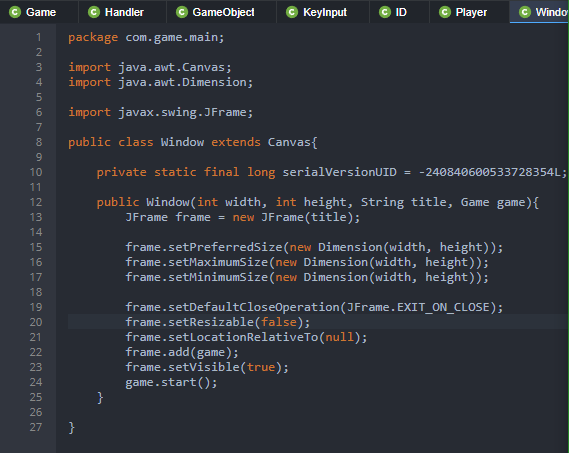
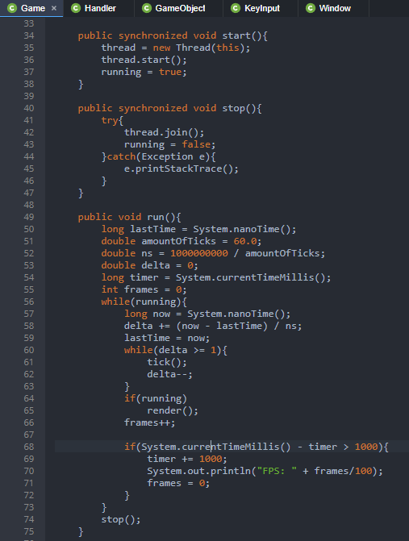
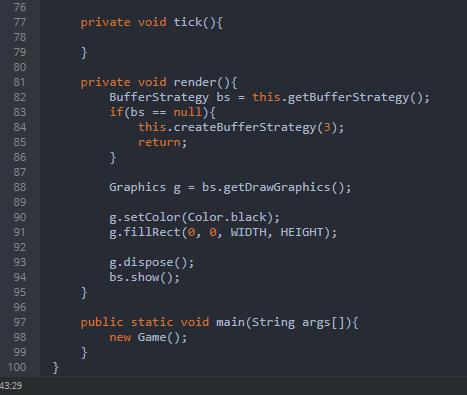

<h1>Java API-Independent-Study</h1>

Learning to make a game out of Java for the next 9 week, the third week, I watch a Yotube series on how to make a game in Java.

<h2>Watching YouTube Videos: RealTutsGML, trying to make a window for a game.</h2>

After watching the RealTutsGML first video, I learn a lot of interesting mechanic on Eclipse and the Java language. This is a basic format for creating a Java game. This tutorial explained by the YouTuber is the main program to set up the game to make it work. As working with this program, I realize that I had some trouble understanding some of the basic functionality of the code. As a result of this, I asked my partners for assistance with learning the code.

<ol>

<li>Class: Window</li>

<li>Class: Game</li>

</ol>

<h2>Takeaway</h2>

<ol>

<li>If you can not understand the code, ask for help from a partner or a fellow colleague who is working on similar interest as you.</li>

.

</ol>